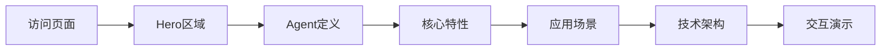

## 1. 产品概述

本项目是一个介绍AI Agent概念、技术架构和应用场景的宣传展示网页，集成到现有的王者荣耀教学网站中。通过现代化的视觉设计和交互体验，向用户清晰传达Agent技术的核心价值和未来潜力。

## 2. 核心功能

### 2.1 功能模块
1. **Agent介绍首页**: Hero区域、Agent定义、核心特性展示、应用场景、技术架构
2. **交互演示区**: 模拟Agent对话流程的交互式演示

### 2.2 页面详情
| 页面名称 | 模块名称 | 功能描述 |
|---------|---------|---------|
| Agent介绍页 | Hero区域 | 动态粒子背景，大标题展示Agent概念 |
| Agent介绍页 | 定义区域 | 什么是Agent，核心概念解释 |
| Agent介绍页 | 特性卡片 | Agent的六大核心特性展示 |
| Agent介绍页 | 应用场景 | 不同领域的Agent应用案例 |
| Agent介绍页 | 技术架构 | Agent系统架构图解 |
| Agent介绍页 | 交互演示 | 模拟Agent与用户对话的交互体验 |

## 3. 核心流程

用户访问Agent介绍页 → 浏览Hero区域 → 了解Agent定义 → 查看核心特性 → 探索应用场景 → 了解技术架构 → 体验交互演示

## 4. 用户界面设计

### 4.1 设计风格
- **主色调**: 深色科技风，以深蓝/黑色为基底，搭配青色/紫色渐变作为强调色
- **按钮样式**: 圆角矩形，带发光效果
- **字体**: 标题使用粗体无衬线字体，正文使用清晰易读字体
- **布局风格**: 单页滚动式，卡片式内容组织
- **图标风格**: 使用lucide-react图标库

### 4.2 页面设计概述
| 页面名称 | 模块名称 | UI元素 |
|---------|---------|--------|
| Agent介绍页 | Hero区域 | 全屏深色背景，动态粒子效果，居中大标题，渐变文字 |
| Agent介绍页 | 定义区域 | 左右布局，文字+示意图 |
| Agent介绍页 | 特性卡片 | 3x2网格卡片，hover悬浮效果 |
| Agent介绍页 | 应用场景 | 横向滚动卡片或标签切换 |
| Agent介绍页 | 技术架构 | 流程图式布局，连接线动画 |
| Agent介绍页 | 交互演示 | 聊天界面模拟，打字机效果 |

### 4.3 响应式设计
- 桌面端优先，适配移动端
- 卡片网格在移动端变为单列
- 交互演示区域在移动端简化
