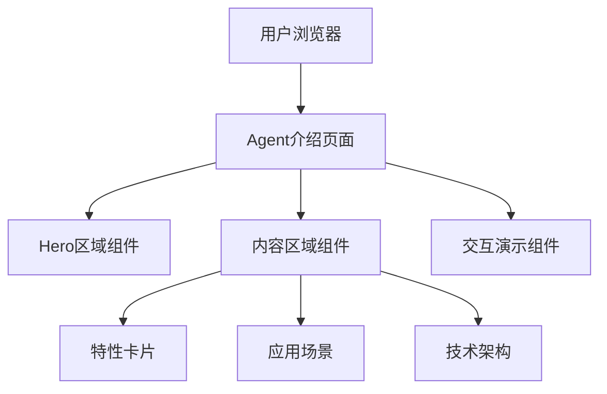

## 1. 架构设计



## 2. 技术描述

- **前端**: HTML5 + CSS3 + JavaScript (原生)
- **样式**: CSS变量管理主题，Flexbox/Grid布局
- **动画**: CSS动画 + JavaScript交互
- **图标**: 内联SVG/Emoji
- **集成方式**: 作为独立HTML页面，通过导航链接接入现有网站

## 3. 路由定义

| 路由 | 用途 |
|-----|------|
| /agent.html | Agent介绍页面 |
| /index.html | 现有首页（添加导航入口） |

## 4. 文件结构

```
/workspace/
├── index.html          # 现有首页（添加Agent入口）
├── agent.html          # Agent介绍页面（新建）
├── css/
│   ├── styles.css      # 现有样式
│   └── agent.css       # Agent页面样式（新建）
└── js/
    ├── script.js       # 现有脚本
    └── agent.js        # Agent页面交互（新建）
```
